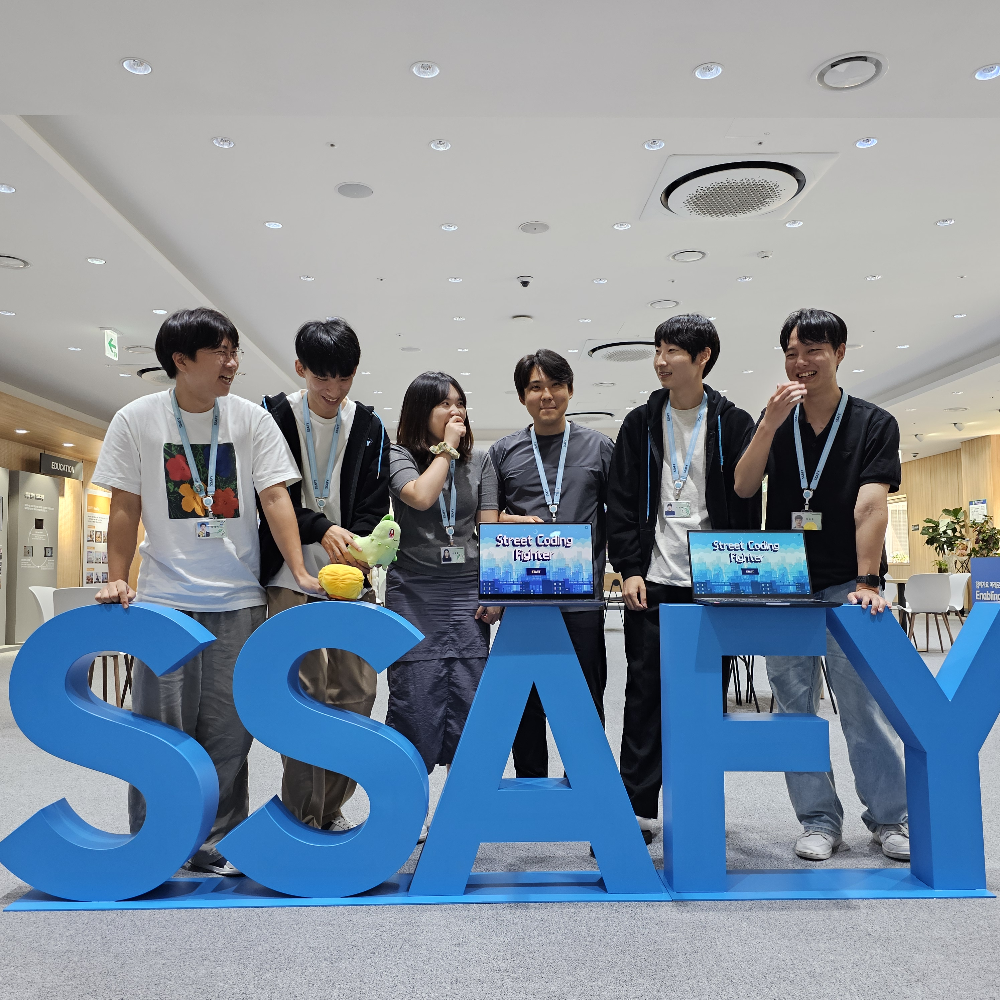

# 🎮 Street Coding Fighter (SCF)

  
  <h3>프로그래밍을 게임처럼 즐기는, 실시간 참여형 학습 플랫폼</h3>
  
  

    ✨ <a href="https://www.notion.so/SSAFY-df70a221ba984927b8fed0d68d34dd92">가화만사성 팀 노션</a>
  

  
   
  
  
  
   
   
  
  <h3>🏆 수상 내역</h3>
  

    
🥈 SSAFY 11기 공통 프로젝트 우수상 - 삼성전자 주식회사

  

  
   
  

### 📜 목차

---

1. [**프로젝트 일정**](#1)
2. [**프로젝트 개요**](#2)
3. [**서비스 소개**](#3)
4. [**주요 기능**](#4)
5. [**기술 스택**](#5)
6. [**산출물**](#6)
7. [**팀원 소개**](#7)
     

### 🗓️ 프로젝트 일정

---

- 일정: 2024년 7월 8일 - 2024년 8월 16일 (6주)
    

### 🔎 프로젝트 개요

---

2017년 교육 과정 개정으로 인해 현재 **고등학생들은 프로그래밍 교육을 의무적**으로 받고 있습니다. 또한, 2025년부터는 초등학생과 중학생도 프로그래밍을 의무적으로 배우게 됩니다.  

저희는 경남 양산의 한 고등학교 학생들을 만나 이야기를 들어보았습니다. 

인터뷰 결과 학생들은 코딩이 중요하다는 것을 알지만, **학교 수업이 이론 중심으로 진행되어 지루하고 재미가 없다**고 말했습니다. 특히 학생들은 **코딩의 중요성을 인지하고 있지만, 이론 중심의 수업과 배운 내용을 단순 학습지에 답안을 채우는 방식의 수업에 흥미를 잃고 있었습니다.**  

이러한 문제를 해결하기 위해, 저희는 어떻게 하면 **학생들이 코딩을 재미있게 배우고 더 효과적으로 학습**할 수 있을지 고민하여 **코딩을 게임처럼 즐길 수 있는 실시간 참여형 학습 플랫폼, '스트릿 코딩 파이터'를 제작**하게 되었습니다.

 

### 🔎 서비스 소개

---

Street Coding Fighter는 프로그래밍을 게임처럼 배우는 실시간 참여형 학습 플랫폼입니다.

 

### 🔎 주요 기능

---

- **스토리 모드**: 실제 교육 과정을 바탕으로 제작된 스토리 모드는 게임처럼 프로그래밍을 하나의 이야기로 학습할 수 있도록 구성되었습니다. 프로그래밍에 익숙하지 않은 사람들도 쉽게 학습할 수 있도록 설계된 튜토리얼 모드입니다.

- **멀티 모드**: 이 모드에서는 최대 100명의 인원이 실시간으로 문제를 풀며 경쟁할 수 있습니다. 학교나 다양한 단체에서 활용할 수 있어, 효과적인 학습 도구로 활용할 수 있습니다.

- **배틀 모드**: 스트리트 코딩 파이터의 이름처럼, 1대1로 빠르게 문제를 풀며 대결하는 모드입니다. 상대방보다 빠르게 문제를 풀어 공격하고, 늦게 풀면 회복하는 시스템으로, 게임의 긴장감과 재미를 극대화했습니다.

- **개인 분석 리포트**: 단순히 문제를 푸는 것만으로는 충분하지 않습니다. 이 서비스는 게임을 즐기면서 학습자의 풀이를 바탕으로 AI가 강점과 약점을 분석하고, 맞춤형 피드백을 제공하여 지속적인 실력 향상을 도와줍니다.

 

### ⚒️ 기술 스택

---

- **Frontend**

  
  
  
  
  
  
  
  
  
  

- **Backend**

  
  
  
  
  

- **Infra**

  
  
  
  
  

- **Database**

  
  

- **Tool**

  
  
  

 

### 📜 산출물

---

**🖋️아키텍처 구조도**

  

**🖋️ERD**

  

### 🖋️주요 기능 화면

---

- **타이틀 화면**
   
     
- **메인 화면**  
     
- **스토리 모드**  
  
  

- **멀티 모드**  
     

- **배틀 모드**  
     

- **개인 분석 리포트**  
     

---

### 👥 팀원 소개

<table>
  <tr>
    <td align="center">
       
      <b>여대기 (Bernie)</b> 
      <i>Frontend</i>
    </td>
    <td align="center">
       
      <b>정범수 (Ethan)</b> 
      <i>Frontend</i>
    </td>
    <td align="center">
       
      <b>이상현 (Falcon)</b> 
      <i>Frontend, AI</i>
    </td>
    <td align="center">
       
      <b>김민욱 (Hermes)</b> 
      <i>Backend</i>
    </td>
    <td align="center">
       
      <b>선예림 (Sophia)</b> 
      <i>Backend</i>
    </td>
    <td align="center">
       
      <b>박지훈 (Jack)</b> 
      <i>Backend, Infra</i>
    </td>
  </tr>
</table>
