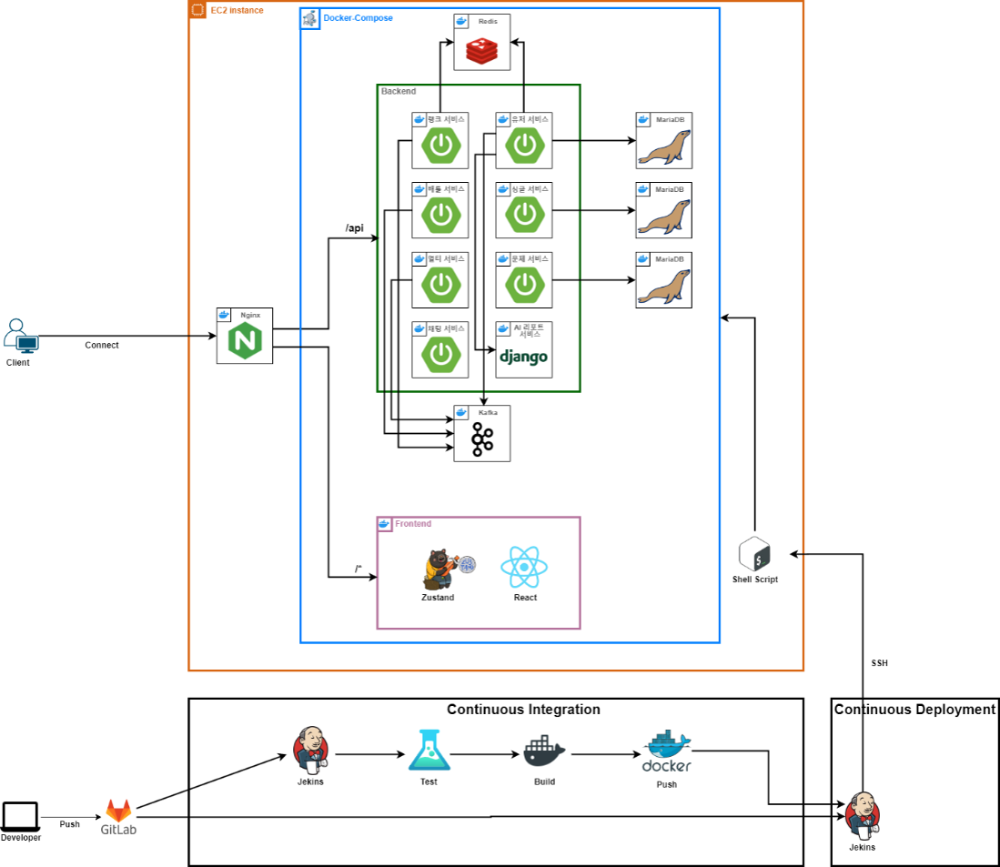
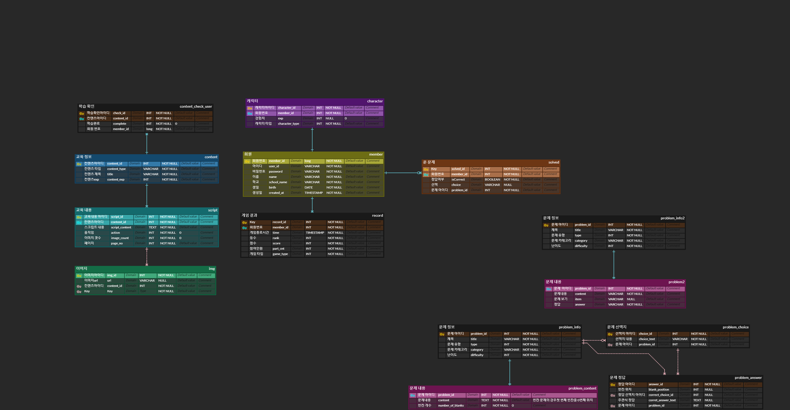

# Street Coding Fighter

  <!--  -->
  아이콘 들어갈자리
   
  <h3> 프로그래밍을 게임처럼 즐기는, 실시간 참여형 학습 플랫폼</h3>
    

     ✨ <a href="https://www.notion.so/SSAFY-df70a221ba984927b8fed0d68d34dd92">팀 노션</a>
  

   

### 📜 목차

---

1. [**프로젝트 일정**](#1)
2. [**서비스 소개**](#2)
3. [**주요 기능**](#3)
4. [**기술 스택**](#4)
5. [**산출물**](#5)
6. [**팀원 소개**](#6)
     

### 🗓️ 프로젝트 일정

---

- 일정: 2024년 7월 8일 - 2024년 8월 16일 (6주)
    

### 🔎 서비스 소개

---

Street Coding Fighter는 프로그래밍을 게임처럼 배우는 실시간 참여형 학습 플랫폼입니다. 

 

### 🔎 주요 기능

---

- **스토리 모드**: 실제 교육 과정을 바탕으로 제작된 스토리 모드는 게임처럼 프로그래밍을 하나의 이야기로 학습할 수 있도록 구성되었습니다. 프로그래밍에 익숙하지 않은 사람들도 쉽게 학습할 수 있도록 설계된 튜토리얼 모드입니다.

- **멀티 모드**: 이 모드에서는 최대 100명의 인원이 실시간으로 문제를 풀며 경쟁할 수 있습니다. 학교나 다양한 단체에서 활용할 수 있어, 효과적인 학습 도구로 활용할 수 있습니다.

- **배틀 모드**: 스트리트 코딩 파이터의 이름처럼, 1대1로 빠르게 문제를 풀며 대결하는 모드입니다. 상대방보다 빠르게 문제를 풀어 공격하고, 늦게 풀면 회복하는 시스템으로, 게임의 긴장감과 재미를 극대화했습니다.

- **개인 분석 리포트**: 단순히 문제를 푸는 것만으로는 충분하지 않습니다. 이 서비스는 게임을 즐기면서 학습자의 강점과 약점을 분석하고, 맞춤형 피드백을 제공하여 지속적인 실력 향상을 도와줍니다.

 

### ⚒️ 기술 스택

---

- **프론트엔드**

    
    
    
    
    
    
    
    
    

- **백엔드**

    
    
    
    

- **인프라**

    
    

- **데이터베이스**

    
    

- **기타**

    
    
    
    
    

 

### 📜 산출물

---

**🖋️아키텍처 구조도**

  

**🖋️ERD**

  

### 🖋️주요 기능 결과 화면

---

- **타이틀 화면**  
     
  
- **메인 화면**  
     
  
- **스토리 모드**  
  
  
  - 스토리 모드는 실제 교육 과정을 바탕으로 제작되었으며, 게임처럼 프로그래밍을 하나의 이야기로 학습할 수 있도록 구성했습니다. 

- **멀티 모드**  
     
  - 최대 100명의 인원이 실시간으로 문제를 풀며 경쟁할 수 있습니다. 또한, 학교나 다양한 단체에서 활용할 수 있어, 효과적인 학습 도구로 활용할 수 있습니다.

- **배틀 모드**  
     
  - 스트리트 코딩 파이터의 이름처럼, 1대1로 빠르게 문제를 풀며 대결하는 모드입니다.
  - 상대방보다 빠르게 문제를 풀어 공격하고, 늦게 풀면 회복하는 시스템으로, 게임의 긴장감과 재미를 극대화했습니다.

- **개인 분석 리포트**  
     
  - 게임을 즐기면서 학습자의 강점과 약점을 분석하고, 맞춤형 피드백을 제공하여 지속적인 실력 향상을 도와줍니다.

### 👥팀원 소개
<!-- markdownlint-restore -->
<!-- prettier-ignore-end -->
|  **Name**  |여대기 | 정범수 | 이상현 |김민욱 | 박지훈 | 선예림 |
| :-----------: | :-----: | :-------: | :------: | :-----: | :------: | :------: |
|  **역할**   | 프론트엔드 | 프론트엔드 | 프론트엔드 | 백엔드 | 백엔드 | 백엔드 |
| **profile** |  |  |  |  |  | |

<!-- ALL-CONTRIBUTORS-LIST:END -->
